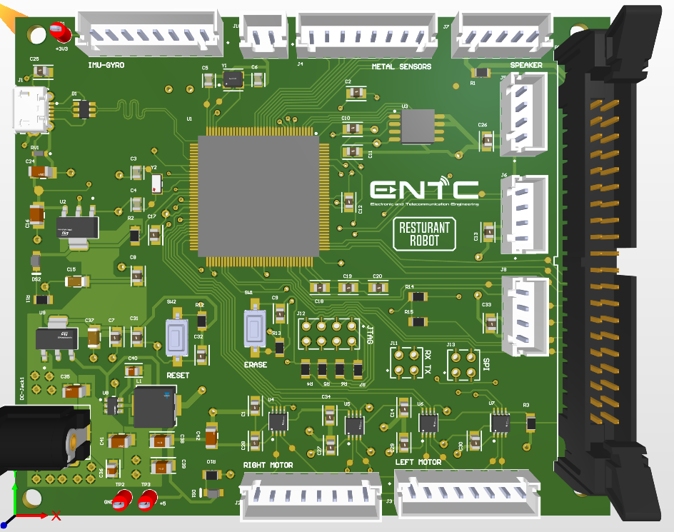

# Restaurant Robot Controller Board – SAM3X Based

This repository documents the design and development of the **ENTC Restaurant Robot Controller Board**, powered by the **Atmel SAM3X8E ARM Cortex-M3** microcontroller. This custom PCB serves as the central controller for an autonomous restaurant service robot, managing motor control, sensors, audio, and more.

---

## 📷 PCB Development Process

### 🧠 1. PCB 3D Model (Design Preview)
Rendered 3D model showing placement of SAM3X, connectors, and components.



---

### 🔧 2. Fabricated PCB (Unassembled)
The bare PCB straight from the manufacturer.


---

### ⚙️ 3. Final Assembled PCB
Fully assembled with SAM3X microcontroller, connectors, and supporting circuitry.


---

## 📌 Features

- **Microcontroller**: Atmel SAM3X8E (84 MHz, 512 KB Flash, 100 pins)
- **USB Support**: Native USB host/device via micro-USB connector
- **Power Input**: 7–12V via DC barrel jack
- **Motor Control**: Dual motor driver channels (left/right)
- **Connectors**: Multiple JST headers for modular plug-and-play
- **Buttons**: Reset, Boot, and Function buttons
- **Peripheral Support**:
  - UART, I2C, SPI communication
  - Speaker port for audio output
  - Sensor ports for obstacle avoidance and feedback

---

## 🚀 Applications

This board is the brain of a **restaurant service robot** that:
- Navigates autonomously
- Communicates with external modules (e.g., IR, ultrasonic)
- Plays audio messages
- Controls motors to deliver food or items

---

## 🛠️ Tools & Technologies Used

- **MCU**: SAM3X8E (used in Arduino Due)
- **IDE**: Arduino IDE with SAM Boards / Atmel Studio / PlatformIO
- **PCB Design**: Altium Designer / KiCAD
- **Firmware**: Written in C/C++ using Arduino Core or ASF (Atmel Software Framework)

---

## 💻 Example Code Snippet

```cpp
// Blink onboard LED on SAM3X
void setup() {
  pinMode(13, OUTPUT);
}

void loop() {
  digitalWrite(13, HIGH);
  delay(500);
  digitalWrite(13, LOW);
  delay(500);
}
